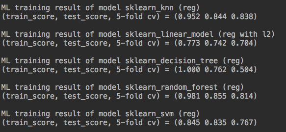
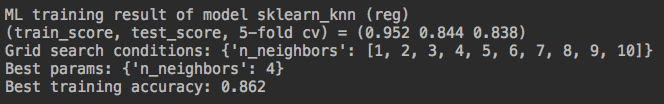

# Machine Learnining Baseline Dashboard
This project presents a quick performance evaluation across few baseline models and serves as a concise databoard before heavy feature engineering and model tuning. The machine package and data format are based on [Scikit-learn ](http://scikit-learn.org/stable/)and [Pandas](https://pandas.pydata.org/). 

## Background

Often, when we receive a new dataset, we may spend some time on exploring the meaning of its features. At the same time, we may just want to take a quick look at how good various models can be. This is why we prepare such goodie workflow to perform quick baseline model evaluation. 

Five basic supervised learning models are selected:

- K nearest neighbor 
- Linear model (linear regression and logistic regression)
- Decision tree
- Random forest
- Support vector machine

## What we get by running this?

Users only need to prepare feature matrix and labels. Make sure he/she **specify** regression or classification **tasks**. Then the basics evaluation metrics can be obtained as.

Grid search is also available across certain predefined parameter ranges to performance quick hyper-parameter optimization. This gives us some hint how much optimization we can obtain beyond default settings. 

## Usage

The main body of this dashboard is collected in main.py and SklearnModel.py. In addition, SklearnDatasetSelector.py is a collection Scikit-learn datasets. It contains three representative tasks in machine learning: Iris classification  (Multi-class classification), Breast cancer classification (Binary classification) and Boston housing price prediction (Regression). 

* main.py: How to call SklearnModel.py for this dashboard
* SklearnModel.py: Collection of basic models
* SklearnDatasetSelector.py: Collection of three Scikit-learn classical datasets 

In main.py, we use Scikit-learn tutorial datasets collected in SklearnDatasetSelector.py to make a demo. Users are free  prepare their own training data and feed to

- x_pd_dataframe: Feature matrix in Pandas dataframe
- y_pd_series: Data label in Pandas series